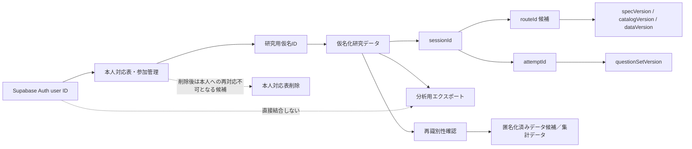
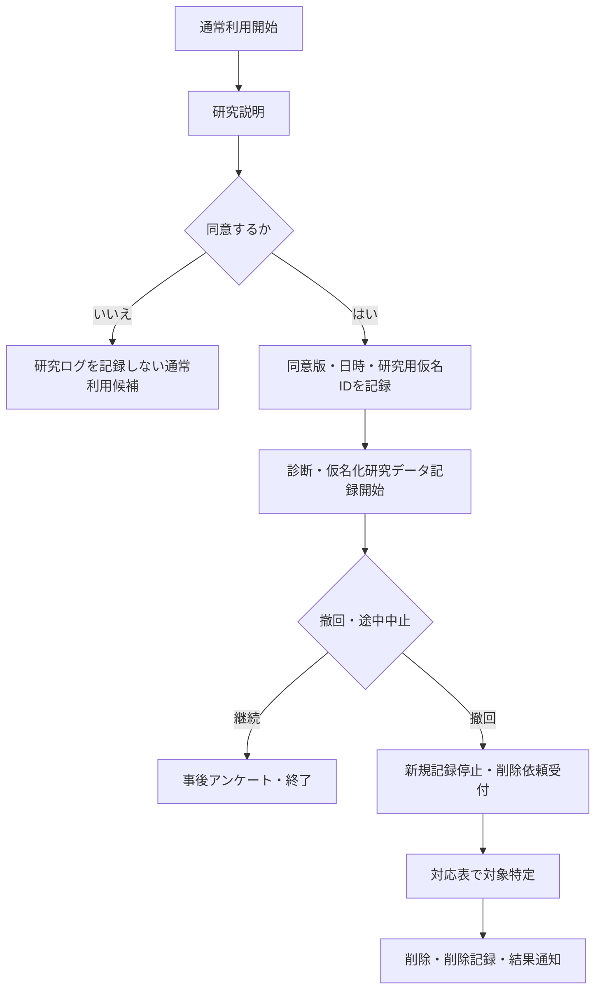

# 研究データ管理仕様 提案

- 状態: **研究者暫定判断記入済み／指導教員確認待ち**
- 暫定判断記入日: 2026-07-14
- 関連Issue: Linear `KAI-12`
- 関連OQ: `OQ-009`、`OQ-004`のDG-08、`OQ-005`の保存境界、`OQ-008`
- 作成基準: `main` `f9a5c0dbff374eaf8aae9a90ca9b111ff3839499`（2026-07-13）
- 重要: **この文書だけでは研究データ収集を開始できない。**
- 重要: 研究者判断欄は研究者本人の暫定案であり、指導教員承認済み仕様ではない。
- 重要: OQ-009は未確定、KAI-12はDoneではなく、研究データ収集、予備試行、KAI-16を開始できない。
- 重要: 本文は法令または学内規程上の正式判断ではなく、指導教員確認により修正、撤回、保留へ戻る可能性がある。
- 重要: 必要な指導教員確認が完了するまで、本文を実装仕様、確定事項、同意文書、または評価開始許可として扱わない。

本文では、既存の正本文書から確認できる内容を`[確定事項]`、現行コードから確認した状態を`[コード存在確認済み]`、採用候補を`[提案]`、判断を要する内容を`[未確定]`として区別する。

## 1. 文書の位置づけ

### 1.1 目的

KAI-12／OQ-009について、研究者本人と指導教員が次の事項を判断できる比較資料を提供する。AIが倫理・個人情報管理を最終決定するものではない。

### 1.2 決定者と承認手順

| 対象 | 決定・確認主体 | 完了の証跡 |
|---|---|---|
| 収集目的、収集項目、分析範囲、実装契約 | 研究者本人 | 判断表の記入、Decision Log、関連正本文書への反映 |
| 同意、撤回、仮名化、匿名化済みデータ候補への移行、保持、削除、権限、学内要件 | 研究者本人・指導教員 | 指導教員チェックリスト、必要な学内手続、Decision Log |
| schema、RLS、migration、同意UI、ログ、エクスポート | 承認済み仕様を受けた実装担当 | 分割Issue、PR、検証証跡 |

承認手順案は次のとおりとする。

1. 研究者本人が§11の判断表を記入する。
2. 指導教員が§12を確認し、学内規程・正式提出資料との不一致を指摘する。
3. 採用内容をDecision Log、`01-confirmed-decisions.md`、`02-open-questions.md`、`05-evaluation-plan.md`、`08-constraints.md`へ必要な範囲で反映する。
4. OQ-009の解消、KAI-12の完了可否、KAI-16の着手可否を研究者本人が判断する。
5. KAI-16等を分割し、実装・検証する。

### 1.3 実装開始・予備試行開始ゲート

- [未確定] KAI-16の実装開始には、少なくとも収集項目、同意状態、研究用仮名ID、保存先、保持・削除、権限、ログ契約の承認が必要である。
- [未確定] 予備試行開始には、上記に加えて同意説明、撤回窓口、エクスポート確認、テストデータによる削除リハーサル、必要な学内手続の確認が必要である。
- [確定事項] 評価開始ゲートEG-08・EG-09が未達なら評価を開始しない。

### 1.4 [提案・未確定] 操作的用語

以下は本提案内で状態を区別するための操作的用語であり、法令上の「仮名加工情報」「匿名加工情報」等への該当性や学内規程上の正式用語を確定するものではない。採用と正式な表現は研究者本人・指導教員・学内規程の確認を要する。

#### 研究用仮名ID

- 認証ユーザーID、氏名、学籍番号、メールアドレス等の直接識別子を含まない研究用IDである。
- 推測困難なopaque IDを候補とし、認証IDから単純hash等で直接導出する案を既定値にしない。
- 本人対応表が存在する間は、対応表を用いて本人へ再対応可能である。
- 仮名化研究データの参加者キーとして用いる候補であり、採用は研究者本人・指導教員確認待ちである。

#### 仮名化研究データ

- 直接識別子を研究ログから分離し、研究用仮名IDを用いたデータである。
- 本人対応表等の追加情報があれば本人へ再対応できる状態である。
- 対応表の保管、アクセス権限、保持、削除を研究ログと分離して管理する候補である。
- 「匿名化済み」と同一視しない。

#### 匿名化済みデータ候補

- 本人対応表を削除しただけで、自動的に匿名化済みとは断定しない。
- 少人数、属性の組合せ、時刻、自由記述、提出コード、学習経路等から再識別できないか確認する必要がある。
- 個人へ合理的に再対応できない状態かを、研究者本人・指導教員・学内規程に基づいて判断する。
- 判断前は`匿名化済みデータ候補`または`再識別性確認後のデータ`と表現し、法令上の「匿名加工情報」等に該当すると断定しない。

#### 集計データ

- 複数参加者の結果を集約したデータである。
- 少人数セル、極端値、自由記述引用等から再識別できる場合がある。
- 集計済みであることだけを理由に匿名と断定しない。
- 最小集計単位、少人数セルの抑制、引用方法は指導教員確認事項とする。

## 2. 既に確定している制約

- [確定事項] 研究目的、収集情報、利用範囲を説明し、同意を得る。
- [確定事項] 参加は任意とし、不参加・途中中止による不利益を生じさせない。
- [確定事項] 氏名・学籍番号と学習ログを直接結び付けない。
- [確定事項] 本人対応表が必要なら、分析データと分離する。
- [確定事項] 研究目的外利用、無断転載、過剰収集を行わない。
- [確定事項] 小規模・短期評価から長期離脱率低下を断定しない。比較条件がなければ固定ルートへの優越性を主張しない。
- [確定事項] AIへ個人識別情報や生の自由記述を入力しない。
- [未確定] 保存期間、削除手順、アクセス権限、保存先、バックアップ、撤回後の削除可能範囲は承認待ちである。

## 3. データ分類

表の保存先は候補であり、採用を意味しない。`研究ID`は認証IDと別の研究用仮名IDを指す。本人対応表が存在する間、研究用仮名IDを用いる研究ログは仮名化研究データであり、本人へ再対応可能である。

| データ群 | 代表項目 | 取得元 | 収集目的 | 必須／任意 | 研究分析 | 直接識別性 | 機微性・再識別リスク | 保存先候補 | 保持判断 | 削除対象 | 出力 | 現行コード上の状態 | 根拠・未決事項 |
|---|---|---|---|---|---|---|---|---|---|---|---|---|---|
| 1. 認証・運用 | auth user ID、メール、表示名、セッション | Supabase Auth、登録画面 | ログイン、通常利用 | 通常利用に必須 | 原則不使用 | 高 | 高 | Auth領域 | 必要 | アカウント・運用記録 | 原則除外 | Auth user ID、メール、氏名相当の入力と`user:{id}`保存コードあり | 分析からの除外方法、通常利用との分離が未決 |
| 2. 研究参加管理 | 研究用仮名ID、同意版、同意状態、同意・撤回日時 | 同意UI／研究者管理 | 適法・倫理的な参加管理 | 研究参加に必須 | 参加可否・欠損説明のみ | 対応表保持中は本人へ再対応可能 | 高 | 研究参加管理領域 | 必要 | 撤回・終了時 | 限定 | 未実装 | 同意版、再同意、撤回境界が未決 |
| 3. 診断 | K群回答、必要ならS/A群、完了状態、再回答 | 初期アンケート | 開始判定、参加者記述 | K群候補必須、S/A群候補任意 | 採用項目のみ | 直接識別子なし／対応表で再対応可能 | 属性組合せで再識別 | 仮名化研究データ／アプリ状態 | 必要 | 対象 | 必要 | 9項目UIと旧重み計算あり、保存接続なし | DG-08、S/A群収集、年齢・職業が未決 |
| 4. ルート入力スナップショット | diagnosis、completed/assumed/inProgress、quiz、error、reflection、catalog | route記録層 | 推薦の再現・監査 | 候補必須 | 利用候補 | 直接識別子なし／対応表で再対応可能 | 詳細履歴の組合せ | 仮名化研究データ | 必要 | 対象 | 必要 | 契約のみ、routeGenerator未実装 | 全量か参照IDのみか未決 |
| 5. ルート結果・理由・版 | 全順序、上位3件、reasonCode、evidence、3版、generatedAt、routeId候補 | route記録層 | 説明可能性・再現性 | 候補必須 | 利用候補 | 直接識別子なし／対応表で再対応可能 | 行動推測 | 仮名化研究データ | 必要 | 対象 | 必要 | 承認済み型契約のみ、保存未実装 | routeId、全順序保存が未決 |
| 6. 学習進捗 | completed、inProgress、開始・完了イベント | アプリ | 学習状態、ルート入力 | 候補必須 | 補助指標候補 | 直接識別子なし／対応表で再対応可能 | 時系列で再識別 | アプリ状態／仮名化研究データ | 必要 | 対象 | 必要 | デモ初期値をReact stateに保持 | 実時間との区別、完了定義が未決 |
| 7. 確認テスト試行 | attemptId/番号、回答、得点、合否、誤答ID、版、時刻 | Quiz | 形成評価、再受験、補助分析 | 結果は候補必須、回答本文は要判断 | 利用候補 | 直接識別子なし／対応表で再対応可能 | 提出内容・時刻 | 仮名化研究データ | 必要 | 対象 | 必要 | 詳細モデルはメモリ内のみ | 全回答保存か正誤のみか未決 |
| 8. 実践課題・エラー | practiceId、提出コード、errorId、SRK、解消、復習先 | PracticeChallenge | 実践状態、復習、エラー分析 | errorId候補必須、コード任意 | 利用候補 | コード次第／対応表で再対応可能 | コード内個人情報の危険 | 仮名化研究データ／コード別領域 | 必要 | 対象 | 必要 | 簡易検出UIのみ。完了時にデータを親へ渡さない | 提出コード保存、自動判定範囲が未決 |
| 9. 振り返り | nodeId、選択式つまずき、自由記述、確定時刻 | Reflection | ルート入力、主観把握 | 選択式候補必須、自由記述任意 | 選択式候補、自由記述要判断 | 自由記述次第／対応表で再対応可能 | 自由記述の再識別・機微情報 | 仮名化研究データ／自由記述分離 | 必要 | 対象 | 必要 | 固定7概念・自由記述・仮値をメモリ保持 | 正規nodeId化、自由記述用途が未決 |
| 10. 事前・事後アンケート | 評価尺度、完了状態、回答時刻 | アプリ／外部フォーム | 受容性・実行可能性評価 | 採用項目は必須候補 | 利用候補 | 属性・自由記述次第／対応表で再対応可能 | 組合せ・自由記述 | フォーム／仮名化研究データ | 必要 | 対象 | 必要 | 評価用事後アンケートなし | 質問文、尺度、実装場所が未決 |
| 11. 自由記述 | 振り返り、アンケート、コメント | 利用者入力 | 改善点・補足理解 | 任意候補 | 要判断 | 内容・対応表次第 | 氏名、所属、第三者情報 | 分離領域 | 必要 | 優先削除対象 | 再識別性確認後のみ | 振り返り欄あり、永続化なし | 収集要否、仮名化、再識別性確認、引用方針が未決 |
| 12. 分析用派生 | 所要時間、再受験数、完了数、集計データ | エクスポート処理 | 分析・図表 | 採用指標のみ | 利用 | 集計方法次第 | 少人数セル・極端値・引用による再識別 | 分析環境 | 必要 | 元データと別判断 | 必要 | 未実装 | 最小集計単位、抑制、欠損規則、派生定義、版管理が未決 |
| 13. 本人対応表 | auth ID／連絡先と研究用仮名IDの対応 | 参加管理 | 撤回・連絡・削除 | 必要な場合のみ | 不使用 | 最高 | 最高 | アプリ外の分離保管候補 | 必要 | 早期削除候補 | 禁止 | 未実装 | 作成要否、管理者、アクセス、保持、削除時期が未決 |
| 14. 監査・操作ログ | export、delete、権限変更、失敗、実行者・時刻 | 管理操作 | 説明責任、誤操作対応 | 最小限必須候補 | 原則不使用 | 中 | 操作者情報 | 管理ログ | 必要 | 対象 | 限定 | 未実装 | 記録範囲、閲覧者、保持が未決 |

## 4. 最小収集案

### 4.1 [提案] 推奨する最小セット

研究目的と再現性に直接必要な次の項目だけを、承認後の必須候補とする。

- 研究用仮名ID、同意版・状態・日時
- 採用された診断回答、診断完了・再回答イベント、`StartNodeDecision`
- `completedNodeIds`、`assumedNodeIds`、`inProgressNodeId`
- 確認テストのquiz/node/attempt ID、試行番号、版、得点・合否、誤答ID、開始・提出時刻
- 実践課題ID、検出・解消した正規errorId、SRK、関連nodeId、イベント時刻
- 振り返りの正規nodeIdによる選択式項目
- ルート入力スナップショット、結果、理由、版、記録層が付与する`generatedAt`
- 承認済みの事前・事後アンケート選択式回答
- export schema version、欠損理由、データ品質警告

### 4.2 任意候補

- 自由記述、提出コード、S群・A群回答、学習時間、上位3件のうち学習者が選択したノード。
- 任意項目は、なくても通常利用・研究参加を継続できる設計候補とする。

### 4.3 収集しない候補

- マウス移動、全クリック、キー入力単位の画面操作ログ。
- パスワード、access token、secret、IPアドレス、User-Agentの研究分析用複製。
- 研究目的に使わない氏名、学籍番号、詳細な職業、住所、生年月日。
- 生の自由記述や提出コードをAIへ送信した履歴。

### 4.4 自由記述・コード・学習時間のリスク

- 自由記述とコードには氏名、所属、URL、第三者情報が混入し得る。収集する場合は注意文、入力制限、仮名化、アクセス分離、再識別性確認、引用前確認が必要である。
- 学習時間は、`startedAt`と`submittedAt`の差だけでは離席を区別できない。`activeDuration`を追加する案も操作ログを増やすため、[提案] 初版はイベント間経過時間を「推定所要時間」と明示し、上限処理・欠損規則を承認事項にする。
- [提案] 画面操作の詳細ログは収集せず、研究質問へ直接対応する確定イベントのみ記録する。

## 5. ID・分離設計

| ID | [提案] 役割 | 制約候補 |
|---|---|---|
| 認証ユーザーID | 通常利用・認証 | 分析データへ出さない |
| 研究用仮名ID | 仮名化研究データの参加者キー | 推測困難なopaque ID。認証IDから単純hash等で直接導出せず、対応表保持中は本人へ再対応可能 |
| 本人対応表 | 研究用仮名IDと認証ID・連絡先等の対応。撤回・削除・連絡に利用 | 仮名化研究データと別保管し、目的、担当者、アクセス、保持、削除を別途承認 |
| sessionId | 1回の利用・実施単位 | 再ログインと研究セッションの定義を分ける |
| attemptId | クイズ試行の一意キー | 全試行で一意、上書き禁止 |
| questionSetVersion | 問題・採点契約版 | 各試行に必須 |
| 3種のroute版 | 仕様・カタログ・データ版 | ルート結果に必須 |
| 分析用エクスポート | 分析・監査用の抽出データ | 研究用仮名IDを保持・除外・再発番する条件を判断。直接識別子と対応表は含めない |
| 集計データ／匿名化済みデータ候補 | 複数参加者の集約値または対応表削除後のデータ候補 | 少人数・属性・時系列等の再識別性確認前に匿名化済みと断定しない |

### 5.1 `routeId`比較

| 案 | 長所 | 短所 | 適用条件 |
|---|---|---|---|
| A: opaqueな`routeId`を導入 | 再計算履歴、表示、選択、分析を安定して結合できる | ID生成・一意性・削除対象が増える | 複数ルート履歴を保存し、表示・選択まで追跡する場合 |
| B: 導入せず複合キー | データ項目が少ない | 研究ID、session、generatedAt等の複合条件が必要で結合ミスの余地 | 各参加者・各イベントで1結果だけ保存する場合 |

- [提案] ルート履歴と選択結果を分析する場合はAを推奨する。ただし研究者承認前に導入しない。
- [提案] IDは結果内容から導出せず、保存層でopaque IDを付与する。

## 6. 同意と撤回

### 6.1 [提案] 同意記録の最小項目

- `consentVersion`、`consentStatus`、`consentedAt`、`withdrawnAt`、研究用仮名ID。
- 同意前の通常運用ログを研究データへ遡及転用しない。
- 同意文書変更時の再同意要否を版ごとに判断する。

### 6.2 未確定事項

- 同意しない利用者へ通常利用を許可するか。
- 未成年者を対象とする可能性と追加同意の要否。
- 撤回受付窓口、本人確認方法、処理期限、通知方法。
- 本人対応表が存在する間は研究用仮名IDから対象ログを特定でき、撤回・個別削除を受け付けられる期間は対応表の保持期間と関係する。
- 本人対応表削除後は対象ログを特定できず、個別削除が不可能となる可能性がある。削除不能境界を同意説明と一致させる必要がある。
- 本人対応表削除後も、少人数・属性・時系列・自由記述・提出コード・学習経路等の再識別性を確認せず、匿名化済みと断定しない。
- 匿名化済みデータ候補または集計データとなった後の削除不能境界を設けるか。
- 予備試行と本実験で同じ同意版・データ仕様を用いるか。

これらの撤回可能期間、本人対応表の保持・削除、再識別性確認、削除不能境界は研究者本人・指導教員判断待ちである。

## 7. 保存先とアクセス権限

| 案 | 実装負荷 | セキュリティ | 再現性・分析 | 削除 | 権限・バックアップ | 誤収集・期間リスク |
|---|---|---|---|---|---|---|
| Supabaseへ保存 | 中〜高 | RLS・環境分離次第 | 高 | 条件設計次第 | 集中管理可能 | 現在のPRODUCTION環境へ誤投入する危険。別Issue必須 |
| 管理されたファイル／表 | 低〜中 | 保管場所と端末管理次第 | 中〜高 | 手動手順が必要 | 少人数では単純 | 版ずれ、複製、誤持出し |
| アプリ＋外部フォーム分離 | 中 | システムごとの権限が必要 | 結合設計が必要 | 複数箇所対応 | 分離に利点 | ID結合ミス、削除漏れ |
| 予備試行限定の一時取得 | 低〜中 | 対象・期間を狭められる | 本実験へそのまま一般化不可 | 比較的容易 | 手順依存 | 暫定運用の恒久化 |

- [提案] 予備試行は、対象者・期間・項目を限定し、現在のPRODUCTION表示のSupabaseへ参加者データを入れない案を優先比較する。
- [提案] 本実験では、研究ログを専用の非本番／研究用環境へ分離でき、RLS・削除・exportをテストできる場合にSupabase案を再評価する。
- Supabaseを採用しても、schema、RLS、migration、環境分離、バックアップ、削除確認は承認済みの別実装Issueで扱う。

### 7.1 権限候補

| 役割 | 認証データ | 対応表 | 仮名化研究データ | 自由記述・コード | 集計データ |
|---|---:|---:|---:|---:|---:|
| 研究者本人 | 運用上必要な範囲 | 要判断 | 必要 | 採用時のみ | 必要 |
| 指導教員 | 原則不要 | 原則不要 | 確認目的の必要範囲 | 再識別性確認後 | 必要範囲 |
| 実装担当 | テスト環境のみ | 不可 | 合成データのみ | 合成データのみ | 原則不要 |
| AIサービス | 不可 | 不可 | 原則不可 | 不可 | 再識別性確認後のデータのみ要判断 |

## 8. 保持・削除・バックアップ

期間は本文で確定しない。研究者・指導教員は次の起算点候補から選ぶ。

| 判断項目 | 候補 | 確認観点 |
|---|---|---|
| 起算点 | 最終参加日／研究終了日／論文提出日／審査・発表終了日 | 学内規程と説明文の一致 |
| 本人対応表 | 撤回対応が不要になった時点で先行削除／元データと同時削除 | 個別削除可能期間との関係 |
| 元データ | 分析確定後／審査終了後／学内規程の期間終了後 | 再分析・訂正と最小保持の均衡 |
| 集計データ／匿名化済みデータ候補 | 元データと同時／研究成果の検証に必要な範囲 | 少人数等を含め合理的に再対応できないか確認したか |
| バックアップ | 本体と同期削除／短い猶予後に削除 | 復元手順と削除完了日の説明 |

### 8.1 [提案] 削除手順

1. 受付日時、対象研究、本人確認方法、処理担当を記録する。
2. 対応表で研究用仮名IDを特定する。
3. 新規収集を停止する。
4. 参加管理、研究ログ、自由記述・コード、エクスポート、作業用複製、バックアップの対象を列挙する。
5. 承認済み手順で削除し、件数・場所・実行者・日時を監査ログへ残す。
6. 個別削除不能な集計データまたは匿名化済みデータ候補がある場合、同意説明に記載した境界と一致し、再識別性確認を終えているか確認する。
7. 依頼者へ結果を通知する。

誤取得時は収集停止、影響範囲特定、隔離・削除、指導教員・必要な学内窓口への報告要否判断、再発防止を行う候補とする。

## 9. ログ契約

すべてのイベントに、採用後の共通項目候補として`eventId`、`eventType`、`eventVersion`、研究用仮名ID、sessionId、`occurredAt`、`recordedAt`、関連版、欠損・警告を持たせる。直接識別子は含めない。本人対応表が存在する間、これらは仮名化研究データとして扱う。

| イベント | 記録目的 | 最小項目候補 |
|---|---|---|
| 同意確定・撤回 | 収集可否の監査 | consentVersion、status、日時 |
| 診断完了・再回答 | 開始判定の再現 | 回答版、採用回答、matchedRuleId、完了状態 |
| ルート生成 | 推薦の再現・説明 | 入力snapshot、result、3版、generatedAt、routeId候補 |
| ノード開始・完了 | 進捗と所要時間 | nodeId、event、時刻、完了根拠 |
| 確認テスト提出・再受験 | 形成評価・復習 | attemptId/番号、quiz/node、版、得点、合否、誤答ID、時刻 |
| 実践課題提出 | 課題達成 | practiceId、達成状態、時刻、コード保存有無 |
| エラー検出・解消 | SRK・復習 | errorId、SRK、関連nodeId、検出/解消、時刻 |
| 振り返り確定 | つまずき入力 | nodeId、選択式nodeIds、自由記述有無、時刻 |
| 事後アンケート完了 | 評価回答の欠損管理 | questionnaireVersion、完了状態、回答時刻 |

### 9.1 ルート生成の保存境界

- [確定事項] 純粋な`RouteGenerationResult`に現在時刻を入れない。
- [提案] 保存層が結果受領時にUTC ISO 8601の`generatedAt`を1回付与し、後から上書きしない。
- [未確定] 入力スナップショットを全量保存するか、immutableな参照IDと版で再構成するか。
- [確定事項] 出力は順序付き全ルートを持ち、表示は既定で上位3件である。
- [未確定] 研究ログへ全順序を保存するか、表示上位3件だけを保存するか。再現性の観点では全順序、最小化の観点では上位3件＋結果hashが候補になる。
- [提案] 表示した上位3件と学習者が選択したノードは、UI表示と分析の対応を確認する場合のみ保存する。

## 10. 分析用エクスポート

| 形式 | 長所 | 短所 | 用途候補 |
|---|---|---|---|
| JSON | ネスト構造、理由、snapshotを保持 | 表計算で扱いにくい | 監査・再現・アーカイブ |
| CSV | 集計しやすい | ネスト構造を複数表へ正規化する必要 | 定量分析 |
| 管理表 | 小規模試行で確認しやすい | 手作業・版ずれ | 予備試行限定 |

- [提案] canonical exportを版付きJSONとし、分析用に複数CSV（participants、sessions、routes、quiz_attempts、errors、reflections、questionnaires）へ変換する案を比較する。CSV必須とはしない。
- 直接識別子と対応表をexportへ含めない。版情報、欠損値コード、派生定義、export日時、schema versionを保持する。
- [未確定] 研究用仮名IDを内部分析用exportへ保持するか、除外するか、export単位で再発番するかを判断する。外部共有版では除外または再発番する案を優先比較する。
- 自由記述と提出コードは別ファイル・別権限とし、採用しない場合は列自体を出さない。
- 欠損は空文字だけにせず、`not_collected`、`not_applicable`、`withdrawn`、`system_error`等の採用コードを定義する。

## 11. 研究者判断表

以下の`研究者判断`は、2026-07-14に研究者本人が提示した暫定案である。指導教員承認済み仕様、OQ-009の解消、KAI-12のDone化、法令・学内規程上の正式判断を意味しない。指導教員確認により修正、撤回、保留へ戻り得る。指導教員確認欄は未確認のままとし、承認前にKAI-16、研究データ収集、予備試行を開始しない。

研究者暫定判断の分類:

- 採用: 12
- 修正採用: 8
- 保留: 1
- 再設計: 1

これは指導教員承認数ではなく、研究者暫定判断の分類である。

| ID | 判断項目 | [提案] 推奨案 | 代替案 | 理由・研究／実装影響・リスク | 研究者判断 | 指導教員確認 | 決定後の反映先 |
|---|---|---|---|---|---|---|---|
| DM-01 | 収集対象 | §4.1の最小セット | 詳細ログ追加 | 再現性と最小化の均衡 | **暫定・修正採用:** 研究目的、ルート再現、評価指標、同意・監査のいずれかに直接対応する項目だけを収集する。生回答、提出コード、学習中の自由記述、詳細操作ログ、研究目的に使わない属性は初回評価の収集対象に含めない。 | 未確認 | Decision、評価計画 |
| DM-02 | 自由記述 | 任意・分離・AI入力禁止 | 収集しない | 定性情報と再識別リスク | **暫定・修正採用:** 初回評価では事後アンケートの任意自由記述を最大1項目だけ収集候補とする。学習中の振り返り自由記述は保存せず、構造化された選択項目のみ保存候補とする。 | 未確認 | 同意、分析計画 |
| DM-03 | 提出コード | 初版は保存しない | snapshot保存 | 個人情報・著作物・容量リスク | **暫定・採用:** 初回評価では提出コード全文を保存しない。practiceId、達成状態、正規errorId、SRK、解消状態だけを保存候補とする。 | 未確認 | ログ契約 |
| DM-04 | 画面操作ログ | 収集しない | 限定イベントのみ | 過剰収集防止 | **暫定・採用:** マウス移動、全クリック、キー入力単位の操作ログは収集しない。開始、完了、提出、選択等の定義済みイベントだけを記録候補とする。 | 未確認 | ログ契約 |
| DM-05 | 保存先 | 専用研究環境を優先比較 | 管理表／外部フォーム | 現PRODUCTIONへ誤投入しない | **暫定・修正採用:** 研究ログは専用の非本番研究環境を第一候補とする。本人対応表は研究ログと別の学内承認済み保管先へ置く。現在のPRODUCTION環境には参加者データを保存しない。具体的な保存先は指導教員・学内規程確認後に確定する。 | 未確認 | KAI-16分割Issue |
| DM-06 | 研究用仮名ID | 推測困難なopaque ID | 別方式のランダムID | 直接識別子を分離し、安定結合と対応表による撤回対応を可能にする。対応表が存在する間は匿名化済みではない | **暫定・採用:** 認証IDから単純導出しない推測困難なopaque IDを使用する。本人対応表が存在する間は仮名化研究データとして扱う。 | 未確認 | ID契約 |
| DM-07 | 本人対応表 | 必要な場合のみ別保管し、目的・担当者・アクセス・保持・削除を定義 | 作成しない | 撤回対応と再識別リスクを研究ログから分離して管理する | **暫定・修正採用:** 参加者単位の撤回・削除へ対応するため、最小限の本人対応表を作成する。研究用仮名IDと撤回・連絡に必要な最小情報だけを保持し、研究ログと分離する。 | 未確認 | 管理手順 |
| DM-08 | 保持期間 | 本人対応表と仮名化研究データを分け、学内規程と研究工程から選択 | 同時削除／より短期・長期 | 撤回可能期間、再分析、最小保持の均衡。AIが期間を確定しない | **暫定・保留:** 本人対応表、仮名化研究データ、自由記述、バックアップの保持期間を分けて判断する。具体的な期間と起算点は学内規程・指導教員確認後に確定する。 | 未確認 | 同意・制約 |
| DM-09 | 撤回時削除 | 対応表保持中は特定可能な元データ・複製を削除 | 対応表削除後は個別削除不能境界 | 対応表削除だけで匿名化済みとせず、再識別性確認と同意説明の一致が必要 | **暫定・採用:** 本人対応表の保持中は、対象となる研究ログ、自由記述、エクスポート、作業複製、バックアップを削除対象とする。対応表削除後の個別削除不能境界は同意説明へ明記する。 | 未確認 | 同意・削除手順 |
| DM-10 | アクセス権限 | 最小権限表 | 研究者単独管理 | 継続性と漏えいリスク | **暫定・採用:** 本人対応表は研究者本人のみを原則とし、指導教員は必要時の確認に限定する。実装担当は合成データだけを使用し、AIへ個人情報、生自由記述、提出コードを渡さない。 | 未確認 | 運用手順 |
| DM-11 | バックアップ | 暗号化・期限同期 | バックアップなし | 可用性と削除漏れ | **暫定・採用:** 暗号化されたバックアップを原則1系統とし、本体と同じ保持期限・削除対象とする。復元と削除は合成データで事前検証する。保管場所は指導教員確認後に確定する。 | 未確認 | 運用手順 |
| DM-12 | routeId | 履歴結合時のみ導入 | 複合キー | 追跡性とデータ増 | **暫定・採用:** ルート生成ごとに保存層でopaqueなrouteIdを付与する。 | 未確認 | route契約 |
| DM-13 | generatedAt | 保存層がUTCで付与 | 呼出側注入 | 純粋関数境界を維持 | **暫定・採用:** generatedAtは純粋なrouteGeneratorへ含めず、保存層がUTC ISO 8601で1回だけ付与する。 | 未確認 | KAI-16契約 |
| DM-14 | 全ルート保存 | snapshotと全順序を保存 | 上位3件のみ | 再現性と最小化 | **暫定・採用:** 正規化された入力スナップショット、順序付き全ルート、reasonCode、evidence、specVersion、catalogVersion、dataVersionを保存候補とする。 | 未確認 | ログ契約 |
| DM-15 | 上位3件保存 | 実表示と選択を保存 | 保存しない | 受容性分析との対応 | **暫定・採用:** 実際に表示した上位3件と学習者が選択したノードをrouteIdへ対応付けて保存候補とする。 | 未確認 | ログ契約 |
| DM-16 | 全クイズ試行 | 得点・合否・誤答・版を全件 | 有効試行のみ | D-018追跡とデータ量 | **暫定・修正採用:** 全試行についてattemptId、試行番号、quizId、nodeId、questionSetVersion、得点、合否、誤答ID、submittedAtを保存候補とする。生回答本文とstartedAtは初回評価では原則保存しない。 | 未確認 | quizログ |
| DM-17 | 学習時間 | 推定値と限界を明記 | 収集しない | 離席誤差 | **暫定・再設計:** 初回評価では学習時間を評価指標として収集しない。イベント時刻は順序確認・監査に必要な範囲で保持するが、開始・終了差を学習時間として分析しない。 | 未確認 | 分析計画 |
| DM-18 | export形式・研究用仮名ID | JSON＋派生CSV候補。内部版でID保持要否を判断し、外部共有版は除外または再発番 | 管理表のみ | 再現と分析の両立、外部共有時の再識別リスク | **暫定・修正採用:** 版付きJSONを正本エクスポート候補とし、分析用CSVを派生生成する。内部分析版では研究用仮名IDの保持を候補とする。外部共有版では個人単位データを原則共有せず、再識別性確認済みの集計値を使用する。 | 未確認 | export仕様 |
| DM-19 | 予備／本実験仕様 | 版を分け変更履歴を保持 | 同一仕様固定 | 予備試行後変更の追跡 | **暫定・採用:** 予備試行と本実験のデータ仕様、同意版、問題集合版を分け、変更履歴を保持する。 | 未確認 | versioning |
| DM-20 | 同意しない通常利用 | 研究ログなしで許可する案 | 利用不可 | 任意参加・実装負荷 | **暫定・修正採用:** 募集制の研究参加では、同意しない者は研究に参加しない扱いとする。授業や必須活動で使用する場合は、研究ログを記録しない利用方法または同等の代替手段を用意する。 | 未確認 | 同意フロー |
| DM-21 | 匿名化済みデータ候補への移行条件 | 対応表削除に加えて再識別性確認と指導教員・学内規程確認を必須候補とする | 仮名化研究データのまま保持・削除 | 対応表削除だけを匿名化の十分条件にしない | **暫定・採用:** 本人対応表削除だけでは匿名化済みとしない。属性、時刻、自由記述、提出コード、学習経路等の再識別性を確認し、指導教員・学内規程確認後に扱いを決定する。 | 未確認 | 同意・分析・管理手順 |
| DM-22 | 集計時の少人数セル | 最小集計単位と抑制規則を定義 | 個別判断 | 少人数、極端値、引用による再識別を防ぐ | **暫定・修正採用:** 初回の小規模評価では属性別の細かな部分集計を原則行わず、全体集計を基本とする。部分集計が必要な場合は参加者数確定後に統合・非表示規則を決定する。 | 未確認 | 分析計画・公表手順 |

研究者暫定判断の分類（再掲）:

- 採用: 12
- 修正採用: 8
- 保留: 1
- 再設計: 1

これは指導教員承認数ではなく、研究者暫定判断の分類である。指導教員確認欄は全22件未確認である。

## 12. 指導教員確認用チェックリスト

各項目を`Yes／No／要修正`で確認する。

- [ ] 研究目的に対して収集項目が過剰でない。
- [ ] 通常利用と研究参加が分離され、同意前に研究ログを記録しない。
- [ ] 同意しない場合と途中中止時に不利益を生じさせない。
- [ ] 直接識別子と研究用仮名IDの分離が妥当である。
- [ ] 本人対応表の目的、保管、アクセス、保持、削除が妥当である。
- [ ] 仮名化研究データを匿名化済みデータと同一視していない。
- [ ] 対応表削除後の再識別性確認と匿名化済みデータ候補への移行条件が妥当である。
- [ ] 撤回受付、本人確認、撤回可能期間、削除対象、削除不能境界の説明が妥当である。
- [ ] 保持期間・起算点・研究終了の定義が学内規程と一致する。
- [ ] アクセス権限、持出し、バックアップ、誤取得時対応が妥当である。
- [ ] 自由記述・提出コード・属性情報を収集する必要性とリスクが許容できる。
- [ ] 予備試行と本実験の版・同意・変更管理が妥当である。
- [ ] ルート入力・結果・理由・版・generatedAt・routeIdの扱いが再現性に十分である。
- [ ] 確認テスト全試行と実践エラーの利用範囲が形成的評価の位置づけを逸脱しない。
- [ ] 事前・事後アンケートの質問、尺度、分析方法が研究質問と対応する。
- [ ] 集計データの少人数セル、極端値、引用で再識別を防げる。
- [ ] 同意説明で「匿名」と過大に表現せず、仮名化と削除不能境界を説明している。
- [ ] AIへ渡せるデータ範囲が明確である。
- [ ] 研究データ収集開始前に必要な学内手続が特定されている。

## 13. 承認後の後続Issue

### 13.1 KAI-16へ渡す実装契約候補

承認後、次を機械検証可能な契約へ変換する。

- 同意状態機械、同意版、同意なし・撤回後の書込拒否。
- 認証ID／研究用仮名ID／本人対応表の分離と権限。
- 承認されたデータ辞書、必須・任意、validation、event version。
- append-onlyのクイズ試行とルートイベント、`generatedAt`付与責任、routeId採否。
- retention、delete、backup、export、監査ログの実行手順とテスト。
- 合成データによるRLS、越権拒否、削除、export、復元の検証。

### 13.2 分割案

1. 研究参加管理・研究用仮名ID・同意状態機械。
2. schema・migration・RLS・環境分離。
3. 診断・進捗・クイズ試行の永続化。
4. 実践課題・エラー・振り返り・ルート生成ログ。
5. 事前・事後アンケート接続。
6. export・欠損・分析データ辞書。
7. 撤回・削除・バックアップ・監査ログの通し検証。

routeGenerator保存接続は、routeGenerator自体の実装と混ぜず、純粋関数の入出力契約を保った別Issue候補とする。予備試行開始条件は、承認済み仕様、合成データでの通し検証、削除リハーサル、指導教員確認の完了とする。

## 14. 現行コードから確認した実装事実

以下は研究仕様ではない。

| 調査対象 | [コード存在確認済み] | 未接続・mock・注意 |
|---|---|---|
| 認証ID | Supabase Authの`data.user.id`を返し、アプリstateの`userId`に保持 | 分析用研究IDではない |
| 認証・プロフィール送信 | signupはemail/password/name、signinはemail/password、profileはage/occupation/pace/level/levelScoreをEdge Functionへ送るコードがある | profileは初期アンケートから呼ばれておらず、保存成功未確認 |
| 初期アンケート | 9項目、条件表示、旧重み付きscoreとlevel判定 | サインイン後はDashboardへ直行。診断回答・完了状態は保存しない |
| 進捗 | `completedNodeIds`等をReact stateに保持 | 完了済み1件、streak、hours、scoreがデモ初期値。永続化なし |
| クイズ | 詳細な`QuizAttemptResult`にID、番号、回答、版、得点、合否、誤答、時刻、model versionがある | Quizコンポーネントのメモリ内stateのみ。再表示で初期化、保存なし |
| 実践課題 | 入力コード、簡易SRK検出、正規errorIdから復習先を表示 | 完了callbackはデータを渡さず、提出コード・error・解消履歴を保存しない |
| 振り返り | node、固定7概念、自由記述、日付、recommendationsをメモリ保持 | `quickTestResult=true`は仮値。概念が正規nodeIdでなく、永続化なし |
| 事後アンケート | 該当機能を確認できない | 未実装 |
| ルート生成 | 固定開始ノードと承認済み文書契約がある | routeGenerator、snapshot、reason、版、generatedAt、routeId保存は未実装 |
| Supabase永続化 | `kv_store_f3d88633`へ`user:{id}`と`profile:{id}`を書き込むコードがある | 診断、進捗、試行、課題、エラー、振り返り、ルート、同意、評価ログの送信は確認できない |

### 14.1 調査した主なコード箇所

- 認証・ユーザーID・送信項目: `src/components/Auth.tsx`、`src/utils/auth.ts`、`supabase/functions/make-server-f3d88633/index.ts`、`supabase/functions/make-server-f3d88633/kv_store.ts`
- 診断項目・旧スコア・未保存フロー: `src/data/questionConfig.ts`、`src/components/SignupSurvey.tsx`、`src/App.tsx`
- 進捗・固定値・メモリ状態: `src/App.tsx`、`src/components/Dashboard.tsx`
- クイズの版・採点・全試行モデル: `src/features/quiz/types.ts`、`src/features/quiz/grading.ts`、`src/features/quiz/attempts.ts`、`src/components/Quiz.tsx`
- 実践課題コード・簡易エラー検出・SRK・復習先: `src/components/PracticeChallenge.tsx`、`src/data/errorMappings.ts`
- 振り返りの選択式項目・自由記述・仮値: `src/components/LearningReflectionForm.tsx`、`src/components/LearningReflections.tsx`
- 事後アンケート: `src/`配下を名称・文言で検索したが、評価用事後アンケートに該当するコンポーネントまたはデータ契約を確認できなかった。

## 15. 未決事項と対象外の既知問題

- 研究者暫定判断は記入済みだが、指導教員確認、学内要件、正式提出資料との整合は未確認である。
- OQ-009は未確定、KAI-12は指導教員確認待ちのIn ReviewでDoneではなく、KAI-16は着手可能と確定していない。
- `docs/research/09-decision-log.md`はD-019を「有効」と記す一方、`AGENTS.md`、`01-confirmed-decisions.md`、`10-handover.md`は未承認の提案として扱っている。本作業では解消せず、D-019を根拠として強制適用しない。
- OQ-001、OQ-002、OQ-003、OQ-007、OQ-008、評価質問文・尺度・分析方法は本作業で確定しない。
- DB、RLS、migration、Edge Function、API、同意UI、保存処理、評価ログ、CSV出力、routeGenerator、クイズ・教材・課題内容は変更しない。
